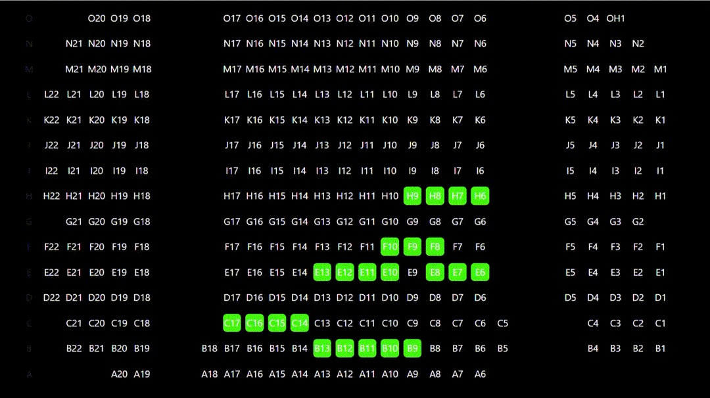
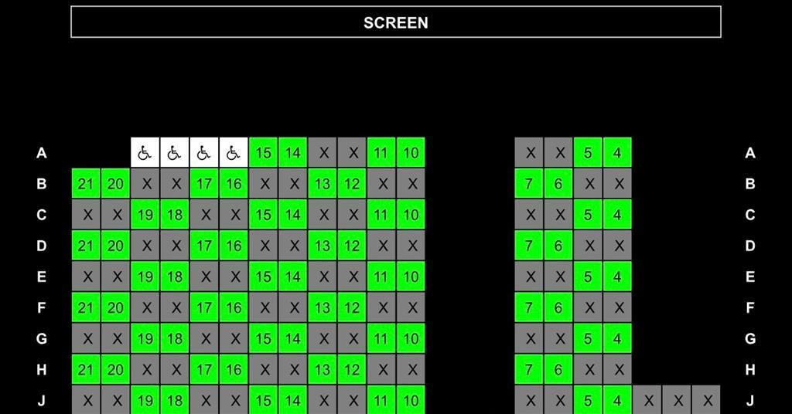
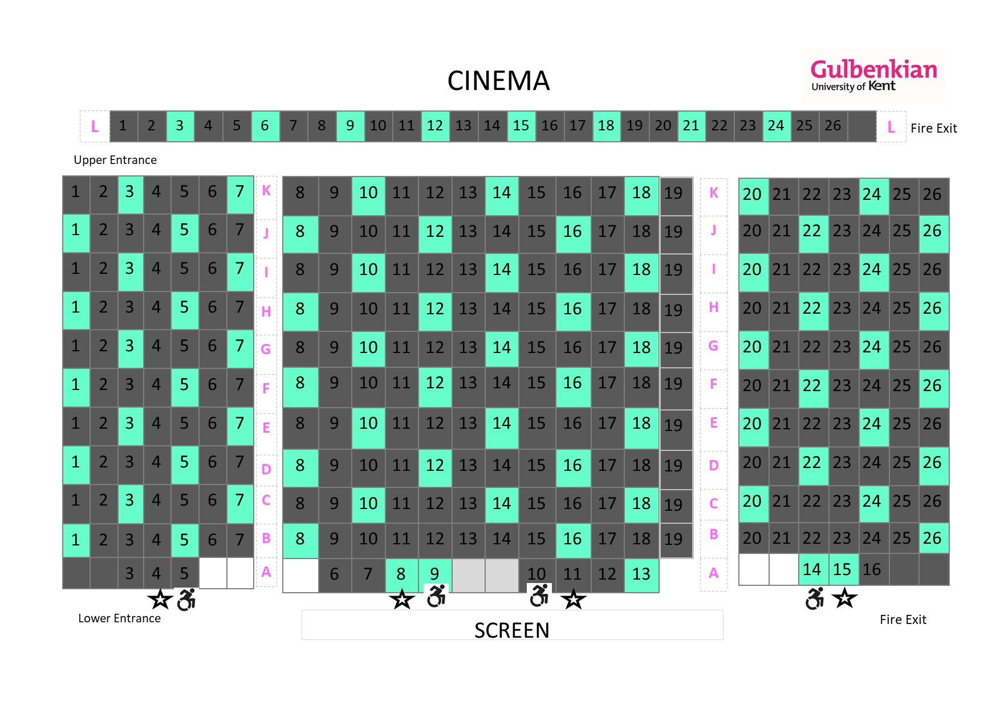

# seat-a-roo

Simple desk booking app for employees at J.P.Morgan. 

[<< demo here >>](https://jojotorro.github.io/seat-a-roo/seats.html)

## Idea from

 I like to go to the cinema and they have the same problem so why not do something simple and similar to the cinema

a normal cinema seating...

a half capacity cinema seating...

a spaced cinema seating...

## Built with

Javascript, Stylesheet(css) and html

[<<tailwind>>](https://tailwindcss.com)

## Published with

GitHub Pages - https://guides.github.com/features/pages/

